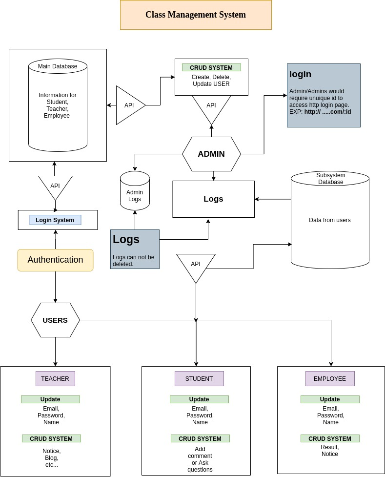

# Class-Management-System

Class Management System in form of web application using Node.js, Express and MongoDB

Develeopment Ongoing:
--------------------

#Project Structure: 

#FRONTEND
- Template Engine EJS
- Admin Login, Logout, Dashboard, View all users, Add new user, Modify users
- User Login, Dashboard

#BACKEND
- Server & Mongodb setup
- Set up Environment Variables
- Handleing Error [improving]
- Hasing all passwords on save
- User/Adimn Authentication
- Cookie based Authorization on different routes
- Role based page Authorization

#NPM_DEPENDENCIES

- express
- mongoose
- bcrypt
- ejs
- dotenv
- express-ejs-layouts
- cookie-parser
- jsonwebtoken
- validator"
